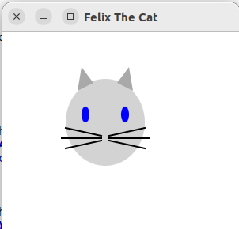
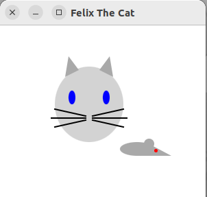

# TP 2: Pratique git

Dans ce TP, vous allez mettre en pratique les branches dans l’outil de gestion de version git.

## 1. Felix the cat

L’exercice consiste à faire un programme a plusieurs en parallèle en utilisant les branches et le merge de git.
Nous vous imposons des contraintes qui sont existantes dans certains projets du « monde réel » (ex : projets open-source) et qui ont pour but de vous donner une expérience des commandes git.

Contraintes :
- Le projet est à faire par groupes de 4 ;
- Deux membres d’un groupe ne peuvent pas être sur la même rangée de table (pour rendre la communication directe plus difficile) ;
- Vous ne pouvez pas communiquer oralement ;
- Le projet est décomposé en plusieurs petites parties qui seront implémentées dans des méthodes différentes ;
- Chaque membre du groupe travaillera sur sa propre branche puis fera un merge de son travail sur la branche commune (master) ;
- Vous ferez des commits et des push le plus souvent possible ;
- Il y aura des conflits, c’est normal et cela fait parti de l’exercice.

### 1.1. Installation

Installation du projet avec git:
- Clonez tous le projet https://gitlab.univ-lille.fr/r3.04/felixthecat.git sur votre machine ;
- Créez un projet commun par groupe ;
- Ajoutez le l’URL du projet commun a votre projet git :
`git remote add <nom-remote> <url>`
Le <nom-remote> pourrait etre « commun » par exemple, ou bien « central » , « principal », ...
- Vérifiez que vous avez bien deux remotes (« origin » et <nom-remote>) : `git remote -v`
- Changez le repository par default (pour les push, pull et fetch à venir) :
`git push --set-upstream <nom-remote> master`.
Si vous n’avez pas fait de commit, cela change juste le defaut, sinon, le push du commit sera fait aussi
- Créez une branche (à votre nom ou autre, mais chacun doit avoir la sienne)
```
git branch <votre-branche>
git checkout <votre-branche>
```
- Vérifiez  que vous avez bien deux branches (« master » et <votre-branche>) et que vous êtres bien sur la deuxième :
`git branch`

Nous vous rappelons qu’il est hautement recommandé d’utiliser git en mode ligne de commande.

Votre git est pour l’instant configuré.

Configuration du projet dans Eclipse :

(Note: Si vous utilisez un autre IDE, vous devriez savoir le configurer par vous même)

- Téléchargez la bibliothèque JavaFX (https://gluonhq.com/products/javafx/). A priori vous avez besoin du dernier SDK pour Linux x86
- Décompressez l’archive dans un endroit connu
- Créez une librairie utilisateur dans Eclipse : `Window > Preferences > Java > Build path > User libraries > New...` , appellez la « JavaFX » par exemple
- Dans la bibliothèque créée, ajouter des « External JARs », selectionnez tous les jar de JavaFX dans le répertoire du point précédant ;
- Validez
- Dans le Build path du projet, ajoutez la nouvelle bibliothèque au Classpath :
`clique droit sur le projet > Build path > Configure Build path... > Libraries > Classpath > Add Library...`
- Lancez l’application, vous devez avoir une erreur. Pour la corriger :
`Menu Run > Run configurations... > Arguments > VM arguments` :
mettre
`--module-path <répertoire-lib-javafx>`
et
`--add-modules=javafx.controls`

Le <répertoire-lib-javafx> se trouve là ou vous avez décompressé JavaFX

Le programme devrait maintenant s’exécuter et afficher une fenêtre vide.

### 1.2. Premier push

Créez les méthodes demandées dans `Felix.java`. Voici un exemple du résultat attendu. La qualité esthétique importe peu, c’est l’exercice git qui est important.


Chacun doit implémenté une méthode différente. Dès que la première version est terminée, faites immédiatement un commit sur votre branche avec un message significatif `git commit -a -m ‘premiere implementation de ...’`.

Faites un push (`git push`), vous devriez avoir une erreur car votre branche n’existe pas sur le remote. Suivez les recommendations de git.

### 1.3. Merge

Tous les membres d’une equipe doivent récupérer les modifications de leurs camarades. Dans la « vraie vie » une seule personne pourrait faire le travail pour tous, ici, et pour apprendre à le faire, tout le monde fera le même travail en parallèle.

Donc commencez par :
`git pull`

Faites ensuite un merge dans la branche commune (master)
```
git checkout master
git merge <votre-branche>
git push
```
Au besoin, résolvez les conflits (v. ci-dessous).

Répétez les merges jusqu’à ce que tous le monde est tout le code.

### 1.4. Conflits

En cas de conflit dans un merge, il faut ouvrir le fichier avec un conflit (ici : `Felix.java`) et intégrer à la main les différentes versions. Git ne peut pas décider tout seul ce qu’il convient de faire.

Vous pouvez travailler avec un éditeur de texte simple, ou avec un outil graphique (Eclipse, Meld, ...). Essayez les deux pour voire et comprendre comment faire.

### 1.5. Replacement

Il peut y avoir des erreurs de placement des éléments. Faites une rotation des méthodes entre les participants (celui qui à fait la tête s’occupe des yeux, celui qui a fait les yeux s’occupe des oreilles, ...) pour améliorer les positionnements.

### 1.6. Extension

Ajoutez une souris dans les mêmes conditions de travail.
 
